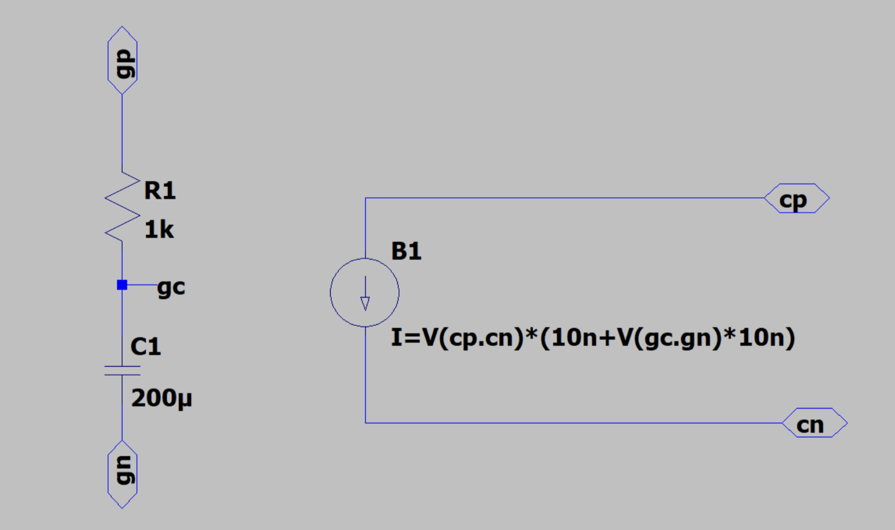
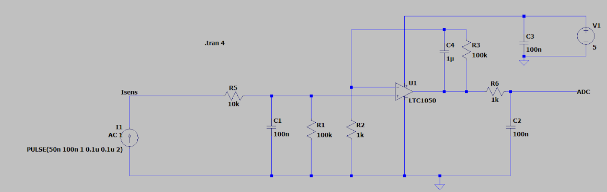
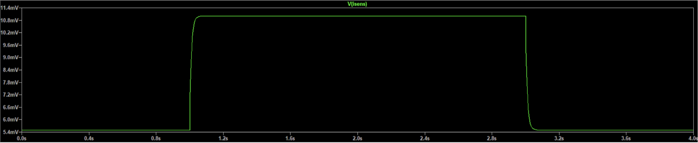
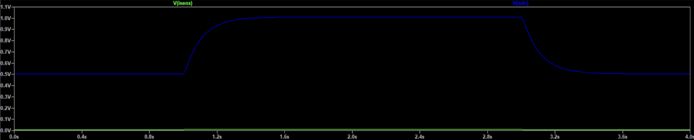
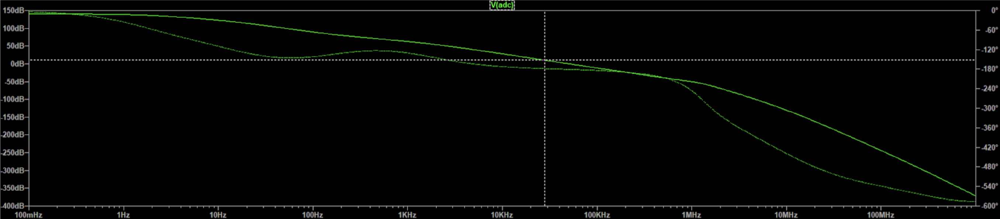
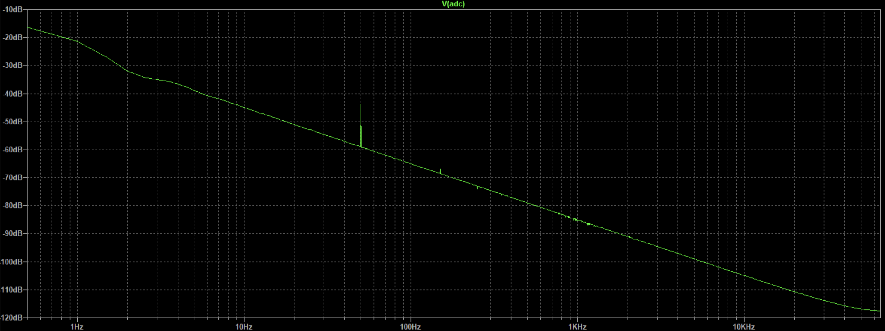
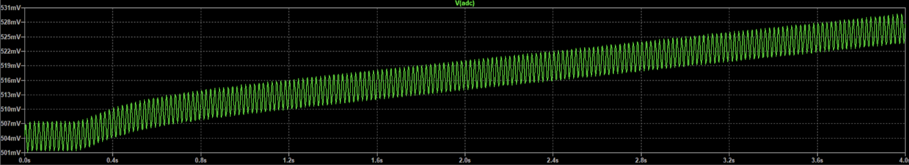

TODO:
- récupérer les données dans node-red pour faire un dash board (ou autre appli android)
- faire le PCB avec tout dessus (ajouter écran OLED, et tout ce qu'on veut)

# Amplification Circuit for Gas Sensor with LTSpice Simulation

## Overview

The gas sensor made during the AIME week internship has an extremely high resistance that varies depending on the type and presence of gas. Its resistance is on the order of **gigohms**, resulting in an extremely low current in the **nanoampere (nA)** range flowing to the ADC. Using an Arduino with a 10-bit ADC necessitates amplifying the signal exiting the gas sensor. We designed an amplifier circuit based on an operational amplifier and simulated it using LTSpice.

Amplifying the signal allows us to avoid the need for expensive equipment like a €15,000 multimeter to measure the high resistance.

---

## Amplifying the Signal from the Sensor

### LTSpice Simulation

The amplifier uses **three different filters**, each with its own cutoff frequency. These filters are essential for shaping the signal and reducing noise. To accurately simulate the gas sensor's behavior, we created a custom sensor component in LTSpice that mimics its high resistance and response to gases.

### Circuit for Simulating the Sensor

Below is the LTSpice circuit used to simulate the gas sensor:

### LTSpice Circuit of the Amplifier

Below is the LTSpice circuit, integrating the gas sensor and filters:  

---

## Verification of Nominal Functionality of the Amplifier

### Transient Response

Below is the LTSpice transient simulation for the input and output:

#### Input Transient Simulation:
- Input: PULSE of current, from **50 nA** to **100 nA**.
- Output observed: **5 mV** to **10 mV**, due to the **100 kΩ shunt resistance**.

#### Output Transient Simulation:
- Voltage at the ADC is amplified by a factor of **101** (gain of the Amplificator = $1+\frac{100\text{k}}{1\text{k}}$).

The behaviour of our Amplifier is therefore correct, and we can go through the frequency analysis.

---

## Frequency Analysis

### Bode Diagram

The Bode diagram below shows the frequency response of the amplifier circuit:

The observed gain is **140 dB**, consistent with theoretical expectations.
Indeed, the transfer function is given by:

$H = \frac{V_{\text{out}}}{I_{\text{in}}}$

Where $V_{\text{out}} = 0.5 \text{V}$, $I_{\text{in}} = 50 \text{nA}$.  
Substituting into the formula, we get:

$H = \frac{0.5}{50 \times 10^{-9}} = 10^7$

On the other hand, we have 
$140 \text{dB}=10^{\frac{140}{20}} = 10^7$
 
The Bode diagram results are coherent with the input-output data and confirm the amplifier's performance.

---

## Filter Design and Characterizing the Amplification

### Cutoff Frequencies and Attenuation

Below are the cutoff frequencies for each filter. They have been measured in LTSpice:

| Filter | Cutoff Frequency |
|--------|-------------------|
| 1      | 15 Hz            |
| 2      | 1.6 Hz           |
| 3      | 1.55 kHz         |

The filters have the following purposes:
1. **First Filter (C1, R1, R5):** Filters out noise originating from the gas sensor itself.
2. **Second Filter (C4, R3):** Reduces the **50 Hz** noise from the power grid.
3. **Third Filter (C2, R6):** Acts as an **anti-aliasing filter**, preventing signal distortion during digitization.

---

## Analysis of Noise and Filtering

### Frequency Analysis and Noise Reduction

FFT analysis of the ADC voltage demonstrates the effectiveness of the filters in reducing noise:
- **50 Hz Noise:** Clearly attenuated by the second filter (C4, R3).
- Increasing the second filter's capacitance reduces the 50 Hz noise further. However, excessive capacitance can distort the signal.

Fast Fourier Transform with the original filter:

Fast Fourier Transform when increasing the capacitor too much:

---

## Formula for Sensor Resistance

The gas sensor's resistance can be derived from the voltage measured by the ADC using the formula:

$R = \frac{V_{\text{ADC}}}{I_{\text{sensor}}}$

Where:  
- $R$: Resistance of the gas sensor  
- $V_{\text{ADC}}$: Voltage measured by the ADC (0 to +5V, represented by values from 0 to 1023 in the Arduino).  
- $I_{\text{sensor}}$: Current through the sensor.

This formula ensures accurate measurements of sensor resistance, even for high resistance and low current values.

---

## Conclusion

This amplifier circuit ensures accurate measurement and analysis of gas sensor behavior, enabling the Arduino ADC to handle high resistance and low current signals. Through LTSpice simulation and
